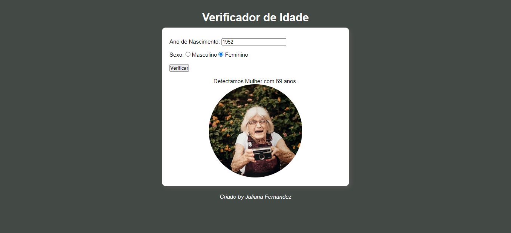

<h1 align="center">
    Age Checker
</h1>

<h1 align="center">

  </h1>

<h3 align="center">
    <a href="https://age-checker.netlify.app/">Access demo page</a>
<h3 >

# Index

- [About](#-about)
- [Technologies used](#-technologies-used)
- [How to download the project](#-how-to-download-the-project)

## 🔖&nbsp; About

The Age Checker is a project created in a Gustavo Guanabara's JS Course to practice JavaScript creating elements in HTML and changing an element style dynamically.

---

## 🚀 Technologies used

The project was developed using the following technologies

- Semantic HTML5 markup
- CSS custom properties
- Flexbox
- JavaScript
- Mobile-first workflow
- VS Code

---

## 🗂 How to download the project

    - Clone the repository
    - Enter directory
    - Install dependencies
    - Start project
   
---

Developed ❤ by Juliana Fernandez
